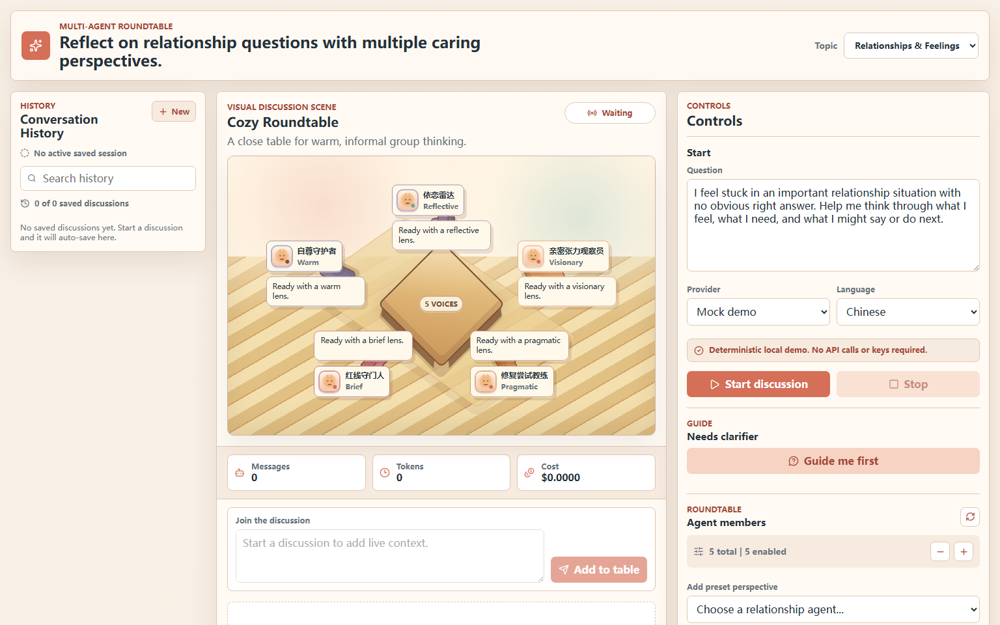

# Multi-Agent Roundtable

[English](README.md) | 简体中文

Multi-Agent Roundtable 是一个本地优先的 React + Express 多 Agent 结构化讨论应用，尤其适合处理没有唯一正确答案的情感、关系和人际问题。用户输入问题并选择讨论模板后，系统会生成 3–5 个 Agent，进行多轮讨论，再由主持人汇总观点，并将会话导出为 Markdown、JSON 或 PDF。

应用保留了无需 API key 的 Mock 演示模式，同时支持通过本地后端调用 DeepSeek 的真实对话模式。API key 只保存在 `.env` 中，不会发送到浏览器。



## 功能特性

- 三栏产品布局：左侧是会话历史，中间是实时讨论与圆桌场景，右侧是控制面板。
- Agent 可配置字段：名字、角色、System Prompt、模型标签、温度、发言风格和启用状态。
- 两类讨论主题空间：情感与关系、哲学与思考。
- 内置模板：关系反思、情绪澄清、冲突调解、恋爱判断、哲学反思、头脑风暴、辩论、同行评审和投资委员会。
- 情感关系 Agent 库：包括共情倾听者、理性分析者、非暴力沟通需求翻译者、边界教练、依恋视角、CBT 重构者和关系修复规划者等预设视角。
- 哲学 Agent 库：包括矛盾与实践视角、苏格拉底式追问者、斯多葛审视者、存在主义镜像、道家平衡视角、物质条件视角和伦理裁判等方法型角色。
- 可选的讨论前需求澄清模块：通过 3 轮引导式聊天，将模糊情绪整理为圆桌可讨论的问题和背景摘要。
- 讨论运行过程中，用户可以随时插话、纠正假设或补充背景；后续 Agent 会接收到这些信息。
- ChatGPT 式左侧会话历史：支持浏览器本地自动保存、搜索、恢复、删除和新建讨论。
- 安全的 GFM Markdown 渲染：支持列表、表格、引用、行内代码和代码块。
- 可指定模型使用中文或英文进行讨论。
- 每次发言前都会生成全桌简报，包括共同点、分歧、开放问题和多个历史观点引用。
- Agent 专属注意力过滤，避免共享简报抹平各角色的职责、理论视角和表达风格。
- 讨论协议要求后续 Agent 明确回应已有观点，并说明赞同、反对或部分赞同，而不是各自发表孤立演讲。
- 主持人会把用户问题和讨论结果连接到依恋理论、非暴力沟通、CBT、关系修复、边界、决策理论和认知偏差等相关框架。
- 发言顺序支持固定、确定性随机和主持人点名。
- 视觉主题包括温馨家庭、哲学书房、工作模式和科技畅想，并使用本地生成的 PNG 素材。
- Provider 模式包括 Mock 演示和通过本地 Express API 运行的 DeepSeek live。
- 讨论开始前会显示本地 API 和 DeepSeek key 的就绪状态。
- Token 与费用统计优先使用真实 provider usage，并按 V4 模型价格估算。
- 支持导出 Markdown、JSON 和浏览器端生成的 PDF。
- 测试覆盖模板生成、发言顺序、主持人总结、导出、本地历史、运行中切换会话和 App 级交互路径。

## 技术栈

- Vite
- React
- TypeScript
- Express
- Vitest
- lucide-react
- jsPDF（仅在导出 PDF 时动态加载）

## 本地开发

首次运行：

```powershell
npm install
Copy-Item .env.example .env
npm run dev:all
```

使用 DeepSeek live 模式前，请把本地 DeepSeek key 写入 `.env`：

```bash
DEEPSEEK_API_KEY=your_key_here
DEEPSEEK_BASE_URL=https://api.deepseek.com
DEEPSEEK_MODEL=deepseek-v4-flash
API_PORT=3001
```

`npm run dev:all` 会同时启动：

- 前端：`http://127.0.0.1:5173`
- API 后端：`http://127.0.0.1:3001`

Mock 演示模式不需要 `.env`。DeepSeek live 模式需要后端服务和 `DEEPSEEK_API_KEY`。

`VITE_API_BASE_URL` 默认是 `http://127.0.0.1:3001`。如果修改了 `API_PORT`，请同步修改这个地址。

只启动 Mock 前端：

```powershell
npm run dev
```

分别启动前后端：

```powershell
# 终端一
npm run api

# 终端二
npm run dev
```

在运行服务的终端中按 `Ctrl+C` 可以停止服务。

## 验证

```bash
npm run check
```

`npm run check` 会依次运行 TypeScript 类型检查、完整测试、素材生成和生产构建。`npm run build` 会在编译静态站点前重新生成本地 PNG 素材。

## 项目结构

```text
src/                    React 前端与浏览器端讨论编排
  components/           历史、圆桌、控制面板、Agent 和需求引导组件
  data/                 主题、模板、场景、视觉主题和 Agent 预设
  lib/                  Provider、讨论引擎、导出、费用与本地存储
server/                 本地 Express API、Prompt 构造和 DeepSeek 适配器
public/assets/          本地生成的头像、主题素材和应用图标
scripts/                确定性的素材生成脚本
.github/workflows/      CI 与可选的手动 GitHub Pages 部署
```

浏览器负责安排每个启用 Agent 的发言顺序。Mock 模式完全在本地模拟流式输出；DeepSeek live 模式把每次 Agent 发言发送给本地 Express API，由后端安全持有 key，并通过 SSE 把 provider 输出流式返回前端。

## GitHub Pages

仓库包含 `.github/workflows/pages.yml`，可用于发布静态演示。该工作流只能手动触发，因此普通 push 不会自动部署应用。

GitHub Pages 只能运行 Mock 演示模式。DeepSeek live 需要本地 Express API 或另行部署的后端代理，因为 API key 不能提交到仓库，也不能放入浏览器代码。

Vite 使用相对资源路径，因此静态应用可以部署在 GitHub 仓库子路径下。

## LLM Provider 边界

前端通过 `LlmProvider` 接口连接模型。`createMockProvider` 在浏览器中生成确定性的模拟流式文本；`createServerProvider` 调用本地 Express API，由后端把每次 Agent 发言转换为 DeepSeek `/chat/completions` 请求：

- `system`：当前 Agent 的身份、角色、System Prompt、发言风格和圆桌规则。
- `user`：原始问题、启用的 Agent、当前全桌简报、可见讨论记录以及轮次和发言位置。
- `stream: true`
- `stream_options.include_usage: true`
- `thinking.type: disabled`

当前版本中，每个 Agent 可编辑的 `Model label` 只是展示元数据。DeepSeek live 模式下，所有启用的 Agent 都会通过 `DEEPSEEK_MODEL` 指定的后端模型运行；GPT、Claude、Gemini 和 Ollama 适配器尚未实现。

用户点击 Stop 或在运行中切换历史会话时，前端会终止当前请求。当客户端断开 SSE 连接后，Express 路由也会取消上游 DeepSeek 请求。费用估算使用 provider 返回的 prompt、缓存和 completion token 数，并按模型分别计算；由于上游定价可能变化，界面金额仍应视为估算值。

API 层采用顺序式群聊：每个发言 Agent 对应一次独立 API 调用，但 Agent 并非只能看到上一条消息。后续 Agent 会收到完整的可见讨论记录，以及包含共同点、分歧、开放问题和多个历史观点的压缩简报。该简报只是共享讨论地图，不代表所有人已经达成共识。每个 Agent 还会根据自己的角色、System Prompt 和发言风格接收专属注意力过滤。

每个 live Agent 的 Prompt 都包含讨论契约：使用 Markdown、以指定语言回答、回应整张圆桌的当前状态、指出正在回应的发言者、说明赞同/反对/部分赞同，并允许没有标准答案的问题保留最终分歧。主持人总结需要分别呈现共同点、未解决的张力、多种合理结果、理论连接、下一步沟通方式以及安全或边界提醒。理论连接必须同时解释适用性和局限，不能被包装为诊断或专业治疗建议。

讨论前需求引导也使用同一个 provider 边界。Mock 模式在本地生成确定性引导；DeepSeek live 模式通过 `POST /api/needs-guide` 进行 SSE 流式交互，依次澄清事件、感受与需求、边界与请求，最后生成 Markdown 需求摘要。摘要会保存为 `preDiscussionContext`，传入圆桌 Prompt 并包含在导出文件中。

## 情感关系反思的使用边界

情感和关系模板用于自我反思、换位思考和沟通规划，不替代心理治疗、医学诊断、法律意见或紧急援助。如果讨论内容涉及自伤、虐待、胁迫或迫在眉睫的危险，Agent 会被要求优先关注现实安全，并建议用户联系可信任的人或当地紧急支持。

## 隐私与安全

- 将 `.env` 保留在本地。它已被 Git 忽略，只应提交 `.env.example`。
- 不要把 provider key 放进 `VITE_` 变量，因为这类变量会被打包进浏览器代码。
- 会话历史保存在当前浏览器的 IndexedDB 中，并以 localStorage 作为降级方案；项目没有账号、云同步或后端数据库。
- 本地 API 只绑定 `127.0.0.1`，并只接受来自 localhost 的浏览器 origin。
- 发布前应使用 `git grep` 或 secret scanner 检查仓库；任何曾在公开位置粘贴过的 key 都应及时轮换。

第一组情感关系 Agent 参考了公开的沟通和心理治疗相关框架，包括非暴力沟通、CBT 式想法—感受—行为梳理、关系冲突管理和依恋取向的情绪工作。这些预设是方法型 persona，不冒充真实专家。

## Agent 设计调研

更丰富的情感关系 Agent 采用“受方法启发的角色原型”，而不是模仿名人或真实专家：

- 依恋理论和 EFT 相关方法启发了 `Attachment Radar`，用于识别追逐—退缩循环、寻求确认、疏远行为和更安全的替代方案。
- Gottman 体系中的修复尝试和连接请求启发了 `Repair Attempt Coach`，用于设计更柔和的开场和小型修复表达。
- Esther Perel 对亲密、欲望、生命力、距离和安全感的讨论启发了 `Desire Distance Reader`。
- Imago 对话方法启发了 `Imago Mirror`，强调先镜映、确认和共情，再进行判断。
- “爱的五种语言”启发了 `Love Language Interpreter`，但产品只把它作为沟通启发工具，而不是严格科学定律。
- 中文互联网情感建议文化，包括陆琪、冷爱、Mystery Method / 搭讪训练和付费挽回咨询生态，启发了两个带防护边界的角色：`Ethical Dating Coach` 只提取基于同意的社交自信训练；`PUA Risk Auditor` 用于识别操控、胁迫、虚假紧迫感和付费咨询陷阱。

哲学与思考主题同样采用方法型角色，不冒充历史人物：

- `Contradiction & Practice Lens` 提炼与《实践论》《矛盾论》相关的实践优先和矛盾分析方法，关注具体条件、主要矛盾以及用行动检验理解。
- `Socratic Questioner`、`Stoic Examiner`、`Existential Mirror`、`Daoist Balance Reader`、`Pragmatist Experimentalist`、`Marxian Material Conditions Lens` 和 `Ethics Referee` 分别提供定义澄清、可控性、自由、顺势、实践检验、物质约束和伦理权衡等不同视角。
- 这些 Agent 不以历史哲学家本人身份发言；哲学模式明确避免宣传、个人崇拜和“单一学派必然正确”的表达。

## 许可证

本项目基于 [MIT License](LICENSE) 开源。

## 完成记录

- 2026-07-07：实现首个可用于 GitHub Pages 的 Multi-Agent Roundtable，包含 Mock 流式输出、可编辑 Agent、三种主题、本地 PNG 素材、Markdown/JSON/PDF 导出、测试和部署工作流。
- 2026-07-07：增加可选择的讨论场景、圆桌舞台、每个 Agent 的发言气泡、当前/上一位发言者状态、移动端场景顺序和场景导出元数据。
- 2026-07-07：将圆桌场景调整为接近 Stanford 小镇的地图风格，加入道路、小建筑和中央广场圆桌，并提供明确的 Agent 增减与删除控制。
- 2026-07-08：升级为本地全栈 DeepSeek live 模式，增加 Express SSE 接口、provider 切换、安全 `.env`、Prompt 与 payload 测试，并保留 Mock 降级方案。
- 2026-07-08：将默认体验调整为关系和情感反思，增加关系模板、预设 Agent 和运行中的用户插话路由。
- 2026-07-08：增加安全 Markdown 渲染、中英文讨论语言选择，以及更强调分歧回应的 Agent 和主持人讨论协议。
- 2026-07-08：基于公开关系框架和中文互联网情感建议原型扩展 Agent 设计，增加恋爱判断模板和 PUA/操控风险边界。
- 2026-07-08：将发言路由从“只传上一条消息”改为全桌讨论简报，并在 Prompt、界面、导出和测试中支持多发言者引用。
- 2026-07-08：增加 Agent 专属注意力过滤和主持人理论映射，让总结能够连接用户处境与相关框架，同时避免将其变成诊断。
- 2026-07-08：增加三阶段讨论前需求澄清，支持 Mock 和 DeepSeek SSE、上下文交接及导出。
- 2026-07-08：将顶部视觉样式选择改为 Topic Space，并增加哲学与思考模式、哲学 Agent、专属 Prompt 规则、主题、素材和测试。
- 2026-07-08：增加浏览器本地 Session History，支持自动保存、恢复、删除和新建讨论。
- 2026-07-08：将历史记录升级为 ChatGPT 式侧边栏，支持搜索、可见会话列表、当前会话高亮和运行中安全切换。
- 2026-07-08：重构为左侧历史、中间讨论、右侧控制的三栏布局，并将 Agent 编辑整合到控制面板。
- 2026-07-08：将中央圆桌重绘为等距像素风房间，加入木地板纹理、菱形桌面、彩色座椅和块状发言卡片。
- 2026-07-08：根据 Claude Code 视觉审查重做圆桌构图，以动态座位替代固定椅子，加入主题感知配色、精简发言预览和更清晰的插画式桌面。
- 2026-07-16：完成公开仓库发布准备，加入可取消 SSE、provider 健康状态、按模型计算的 DeepSeek 费用、响应式与可访问性优化、CI、应用元数据和更清晰的本地安全边界。
- 2026-07-16：增加完整的简体中文 README，并在 GitHub 中提供中英文双向切换入口。
